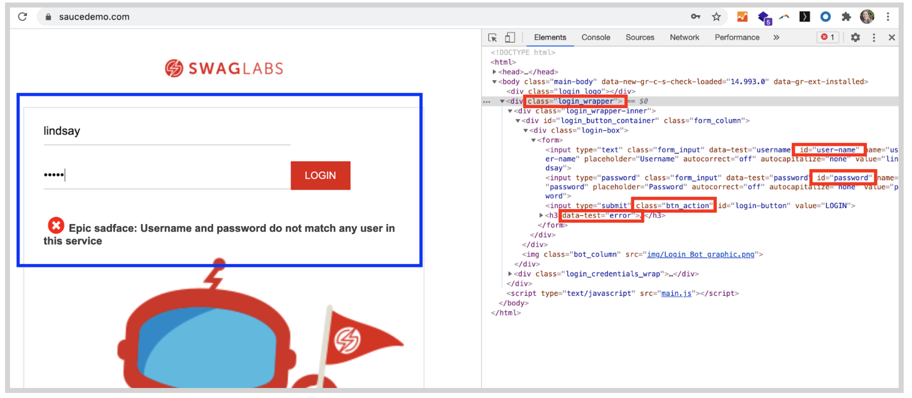

# What You'll Learn

This is an introduction to your tutorial. It will show up on the first page when your tutorial is started.

## 1. Cypress Project Introduction

> This tutorial walks you through creating a very simple test against the 'Swag Labs' app at https://saucedemo.com

This course is created for the purpose of helping users understand the project structure for a Cypress test, and using this to run a test on the Sauce Labs platform using the saucectl tool. It is not intended to demonstarte best practices for writing Cypress tests. More instructions about how to write Cypress tests can be found at cypress.io. 


**Test Directories**

Take a look at the project structure on the right. Open the `/cypress` directory inside you will notice:

* `/pageobjects` – This directory contains code that will help you interact with the login and shopping page on saucedemo.com

* `/integration` – This is a default directory that is used for Cypress tests. You will create a login test here with some checks to make sure the login functionality on saucedemo.com is working. 

* `support` –  This file is created with your Cypress test by default. This is the directory where actions that occur before test files runs are kept. In this example we will be using it to store Sauce Labs credentials.

* `plugins` – This file is created with your Cypress test by default, and is used if you want to manage the Node process to modify your Cypress environment.


## 2. Test File Overview
If you look in your project file, you should also notice a `cypress.json` file alongside the `/cypress` directroy. This is a configuration file for your cypress test code project.

This file is used to set [all kinds of options for your Cypress test](https://docs.cypress.io/guides/references/configuration.html).

We will set the baseUrl, which is the url of the web app you are testing against.

**The Integration Directory**
Open up the `integration` directory. This is the place where the atual tests against an application are stored in a Cypress test project.

It's important to keep the tests in this directory as you will need tests to be here when you use saucectl to run tests on Sauce Labs later on.

Notice there is just one test object in this directory, called `login.spec.js`. This will contain the code that runs the `it()` statements that will test the functionality of the [login flow](https://www.saucedemo.com/).

**1.4 The Pageobjects Directory**
Open up the pageobjects directory and notice there are two files:
* `LoginPage.js` – Code for interacting with the [Swag Labs login page]()
* `SwagOverviewPage.js` – Code for interacting with the [next page, where you can choose swag]()

In the next lessons, we will add setup the page objects, with code to interact with both of these pages.


## 3. Create Page Objects

> Create two page object files, as well as a file to store different sets of credentials to login to Swag Labs

**Cypress.json**

Inside your project file that you created, you will notice the cypress.json file. This file is used to set [all kinds of options for your Cypress test](https://docs.cypress.io/guides/references/configuration.html). If you don’t set any options, Cypress will use a set of default values. You can pull in data from this file into your tests, to make it easier to preload data in your test.

### 3.1 Add a baseUrl to cypress.json

First, you will need to add information for your tests about the URL of the app you are testing against. Add the following line to `cypress.json`, which you will use in your tests to pull in the site you are testing against.

```
{
 "baseUrl": "https://www.saucedemo.com"
}
```

#### HINTS
- This code should be inside cypress.json 

### 3.2 Add Credenitals in constants.js

Next, in the `cypress/support` directory find a file called `constants.js`.

It’s good practice to store sensitive information like a username and a password in a separate file so you can use a .gitignore file to exclude it from Github repositories you will commit your project to.

Open `constants.js` and create the `const` to store different login credentials:

```
export const LOGIN_USERS = {
};
```

Next, inside of `LOGIN_USERS` add in credentials for a user that is locked out of Swag Labs:

```
LOCKED: {
       username: 'locked_out_user',
       password: 'secret_sauce',
   },
```

 Last, add user credentials inside of `LOGIN_USERS` that will allow you to login:

 ```
 STANDARD: {
       username: 'standard_user',
       password: 'secret_sauce',
   },
 ```

Now you can use these objects to login in your tests by calling `LOGIN_USERS.LOCKED` or `LOGIN_USERS.STANDARD`.
#### HINTS
Final code should look like:
```
// filename: cypress/support/constants.js
export const LOGIN_USERS = {
   LOCKED: {
       username: 'locked_out_user',
       password: 'secret_sauce',
   },
   STANDARD: {
       username: 'standard_user',
       password: 'secret_sauce',
   },
};
```

### 3.3 Locate Items on the Login Page
pen the `pageobjects` directory and add a file named: `LoginPage.js`, then open `LoginPage.js` and add the following:


In `LoginPage.js` you will create several get methods to locate elements on the page you will use in your test later on:

```
class LoginPage {
   get screen() {
       return cy.get('#login_button_container');
   }

   get username() {
       return cy.get('#user-name');
   }

   get password() {
       return cy.get('#password');
   }

   get loginButton() {
       return cy.get('.btn_action');
   }

   get errorMessage() {
       return cy.get('[data-test="error"]');
   }

}
```
Since you have baseUrl specified in `cypress.json`, your tests know to visit [https://www.saucedemo.com](https://www.saucedemo.com). The first `get` method locates the div in blue below, where the other elements are found.

![assets/TRT1.04B.png]



You can also see the ids, classes, and `data-test` element that your tests’ `get` methods use to locate other elements on the page.

### 3.4 Add a SignIn method

Next, below the get methods, add in the code to create your `signIn method`, and export the` LoginPage` class so it can be used by other classes (your test methods).

```
// filename: cypress/pageobjects/LoginPage.js
// ...


   signIn(userDetails) {
       const {password, username} = userDetails;

       if (username) {
           this.username.type(username);
       }
       if (password) {
           this.password.type(password);
       }

       this.loginButton.click();
   }
}

export default new LoginPage();

```

If you recall, in `const.js` there is a constant created called `LOGIN_USERS `which contains two objects, either `LOCKED` or `STANDARD`.

The `signIn()` method will allow you to pass either the `LOCKED` or `STANDARD` object in with the `username` and `password` values.

Later, when you call that method in your test, you will pass in the set of username and password fields from `const.js` depending on whether you call the method with `signIn(LOGIN_USERS.STANDARD)` or `signIn(LOGIN_USERS.LOCKED).`

#### HINTS
The final `LoginPage.js` should looks like this:

```
class LoginPage {
   get screen() {
       return cy.get('#login_button_container');
   }

   get username() {
       return cy.get('#user-name');
   }

   get password() {
       return cy.get('#password');
   }

   get loginButton() {
       return cy.get('.btn_action');
   }

   get errorMessage() {
       return cy.get('[data-test="error"]');
   }
   signIn(userDetails) {
       const {password, username} = userDetails;

       if (username) {
           this.username.type(username);
       }
       if (password) {
           this.password.type(password);
       }

       this.loginButton.click();
   }
}

export default new LoginPage();
```
### 3.5 Create Inventory Page Object
The page that you enter after you enter login credentials also needs to be accessed. This is known as the _Inventory_ or _Swag Labs_ page.

![assets/TRT1.04C.png]

Open `SwagOverviewPage.js` and copy in the following code:

```
get screen() {
        return cy.get('.inventory_list');
    }
```

 This will go to the sauce demo page that lists the products, and search for the div that contains the list of items with an id of `inventory_list`.

 #### HINTS

 Your `SwagOverviewPage.js` file should look like this:
 ```
//filename: cypress/pageobjects/SwagOverviewPage.js
class SwagOverviewPage {
    get screen() {
        return cy.get('.inventory_list');
    }
}
export default new SwagOverviewPage();
```

## 4. Create a Cypress Test

> Create a test spec file for the Swag Labs login page. 


Now that you have all the configuration files and page objects created, you can create your first test object to use all of these elements and run a test.

In the `cypress/integration `directory, find the file named `login.spec.js`. In accordance with [Page Object Model (POM) conventions](https://www.selenium.dev/documentation/en/guidelines_and_recommendations/page_object_models/), you are creating separate directories & files for page and test objects.

Open `login.spec.js` and take a look at the `describe()` method to set up your test. The `cy.visit() `method contains an empty string because it will automatically pull the `baseUrl `from the `cypress.json` file:

```
describe('LoginPage', () => {
   beforeEach(() => {
       cy.visit('');
   });
```

### 4.1 Add Your First It Assertion - Login Page

Next, add in an `it()` method, which is a Mocha/ Cypress standard for declaring test methods. This will check to see that when you get onto the page, the `screen` (Defined in `LoginPage.js`) element which contains the login field is visible.

Add in an `it()` method, which is a Mocha/ Cypress standard for declaring test methods. This will check to see that when you get onto the page, the `screen` (Defined in `LoginPage.js`) element which contains the login field is visible.

You can add this method right after the `before()` method:

```
it('should be able to test loading of login page', () => {
       LoginPage.screen.should('be.visible');
   });
```
### 4.2 Second It Assertion – Inventory Page

Next, add a test to check that the next page (where you can choose items for your cart.) is visible when you log in with valid user credentials:


```

   it('should be able to login with a standard user', () => {
       LoginPage.signIn(LOGIN_USERS.STANDARD);
       SwagOverviewPage.screen.should('be.visible');
   });
```

#### HINTS

- This is a hint to help people through the test
- Second hint for 1.1, don't worry if the hints don't show up yet

## 5. Introduction to saucectl & the Sauce Labs Platform 

> Optional summary for Level 1

Here's where you can put a description, examples, and instructions for the lesson.

### 5.1 Level 1 Step 1

This is the test text. Create an `index.html` file to pass this lesson.

#### HINTS

- This is a hint to help people through the test
- Second hint for 1.1, don't worry if the hints don't show up yet

## 6. Set Up saucectl Run Cypress Test on Sauce Labs

> Optional summary for Level 1

Here's where you can put a description, examples, and instructions for the lesson.

### 6.1 Level 1 Step 1

This is the test text. Create an `index.html` file to pass this lesson.

#### HINTS

- This is a hint to help people through the test
- Second hint for 1.1, don't worry if the hints don't show up yet


## 7. Run Cypress Test on Sauce Labs

> Optional summary for Level 1

Here's where you can put a description, examples, and instructions for the lesson.

### 7.1 Level 1 Step 1

This is the test text. Create an `index.html` file to pass this lesson.

#### HINTS

- This is a hint to help people through the test
- Second hint for 1.1, don't worry if the hints don't show up yet
